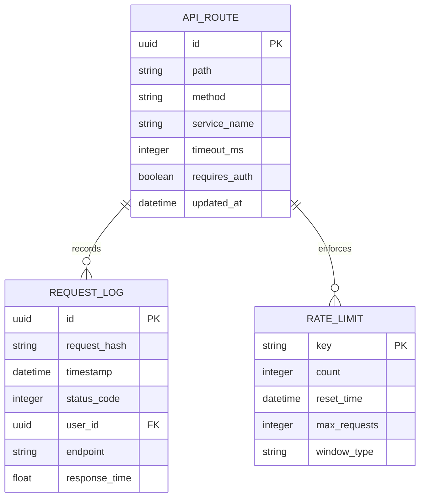

# API Gateway Service

## Ответственность
- Маршрутизация запросов к соответствующим микросервисам
- Аутентификация и авторизация запросов
- Логирование и мониторинг трафика
- Ограничение скорости запросов (rate limiting)

## Границы сервиса
❗ Не содержит бизнес-логики приложения  
❗ Не хранит пользовательские данные  
❗ Не обрабатывает события аналитики

