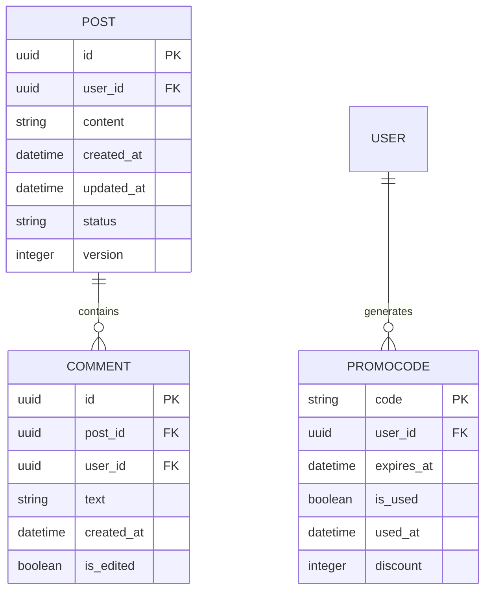

# Content Service

## Ответственность
- Создание/редактирование постов и комментариев
- Генерация и валидация промокодов
- Модерация пользовательского контента
- Управление версиями контента

## Границы сервиса
❗ Не хранит статистику взаимодействий  
❗ Не управляет правами доступа  
❗ Не обрабатывает аутентификацию

