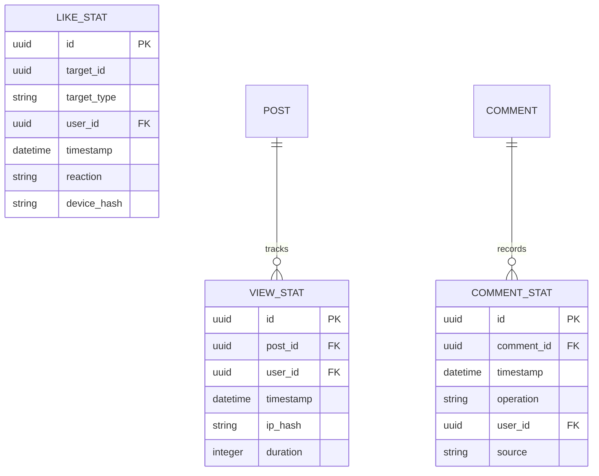

# Analytics Service

## Ответственность
- Сбор и агрегация статистики взаимодействий
- Генерация отчетов в реальном времени
- Хранение исторических данных
- Анализ паттернов поведения

## Границы сервиса
❗ Не имеет доступа к персональным данным  
❗ Не влияет на бизнес-логику приложения  
❗ Не участвует в цепочке запросов в реальном времени

